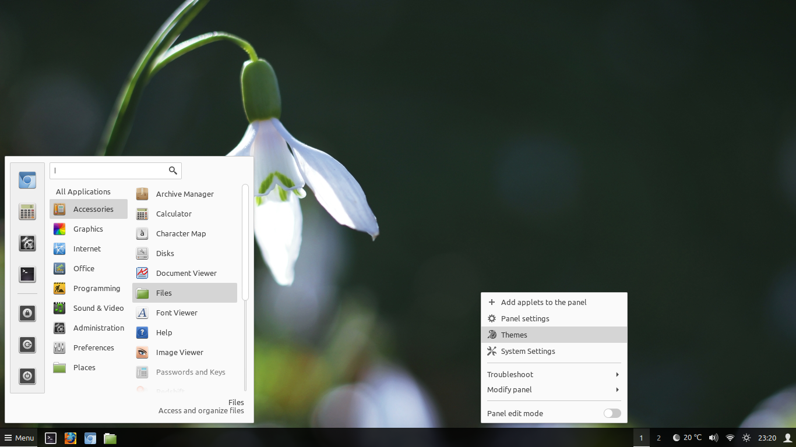
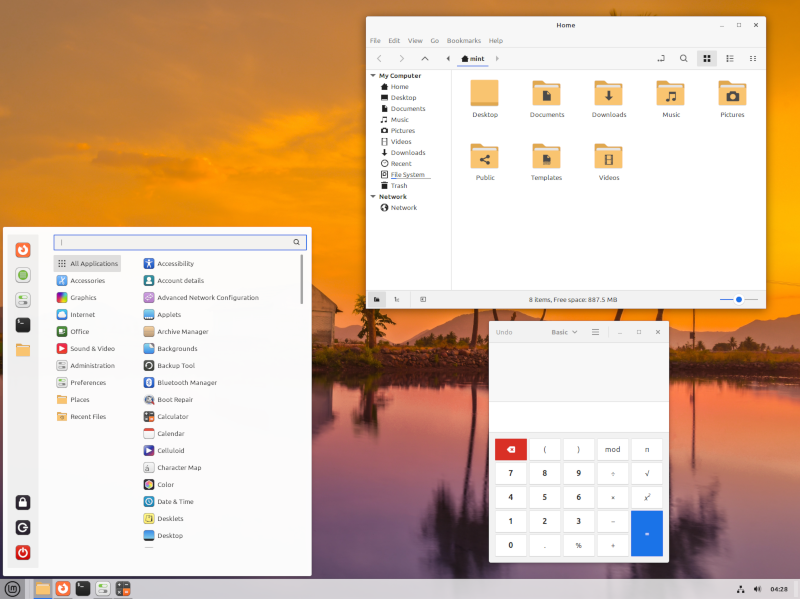
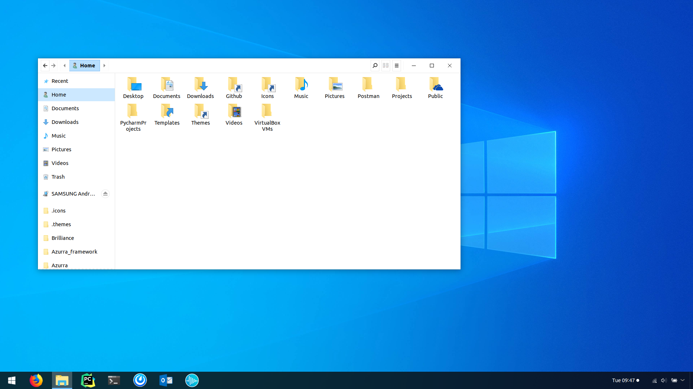

# Linux Mint Themes

## How to Add New Themes

You’re welcome to contribute and expand this collection!  
If you’d like to add a new Linux Mint theme, follow these steps:

1. **Fork this repository**  
   Click on the “Fork” button in the top-right corner to create your own copy of this project.

2. **Add your theme**  
   - Upload a screenshot of your theme inside the `img/` folder (for example: `img/my-theme.png`).  
   - Edit the `README.md` file and add a new section following the same format as the existing ones:  
     ```markdown
     ---
     ### Theme: Your Theme Name
     

     **Name:** Your Theme Name  
     **Official link:** [Download / Source](https://your-theme-link.example)
     ---
     ```

3. **Commit your changes**  
   Save your edits and commit the changes to your fork.

4. **Open a Pull Request**  
   Go back to the main page of your fork and click **“Pull Request”**.  
   Describe what you’ve added, and submit it — your theme will be reviewed and merged into the main project.

---

### Contribution Guidelines

- Make sure the theme is **freely available** (GPL, CC, or another open license).  
- Only include screenshots and links to **official or original sources**.  
- Keep the file names simple (e.g., `adara.png`, `minty-dark.png`).  
- Avoid adding large or copyrighted files.  

Thanks for helping expand this open collection.


## Light Themes

---

### Theme: Adara


**Name:** Adara  
**Link:** [Download](https://cinnamon-spices.linuxmint.com/themes/view/Adara)

---

### Theme: Divo


**Name:** Divo 
**Link:** [Download](https://cinnamon-spices.linuxmint.com/themes/view/Divo)

---

### Theme: Fluent


**Name:** Fluent 
**Link:** [Download](https://cinnamon-spices.linuxmint.com/themes/view/Fluent)

---

### Theme: Nergis Light


**Name:** Nergis Light
**Link:** [Download](https://cinnamon-spices.linuxmint.com/themes/view/Nergis-Light)

---

### Theme: Windows 10 Light


**Name:** Windows 10 Light
**Link:** [Download](https://cinnamon-spices.linuxmint.com/themes/view/Windows-10)

---
